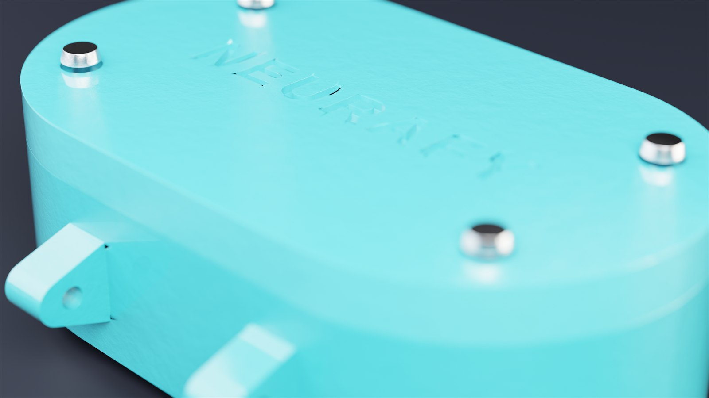
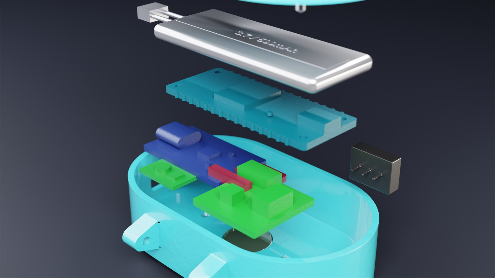
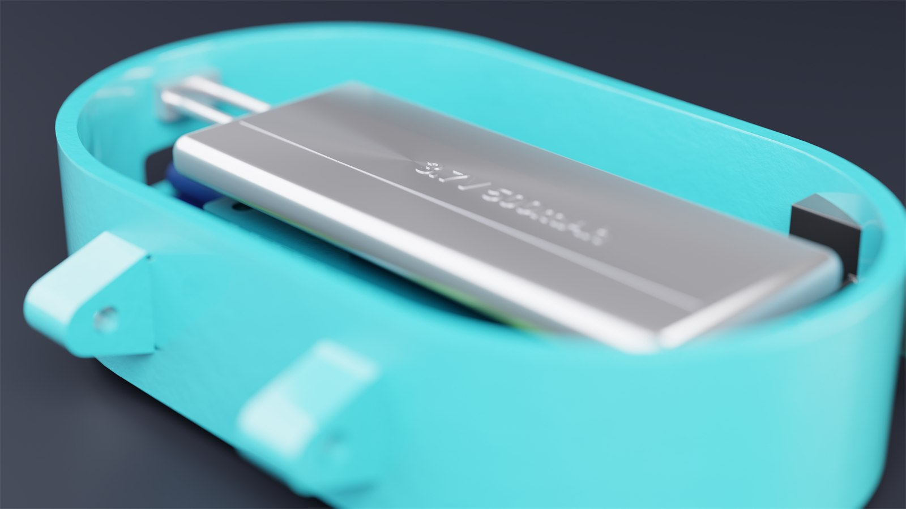
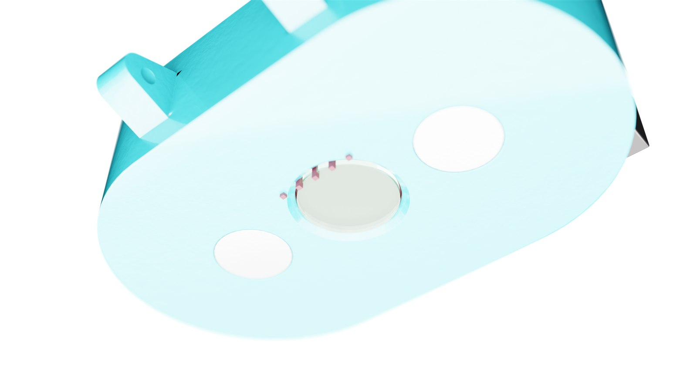
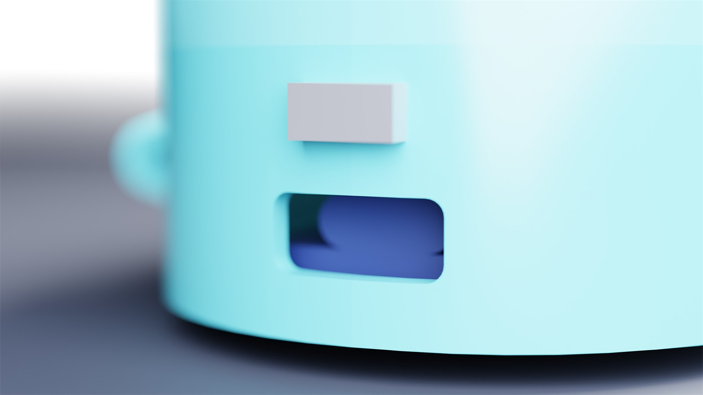
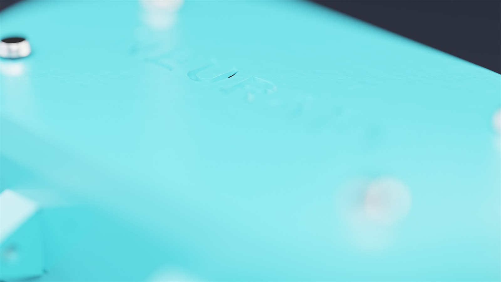
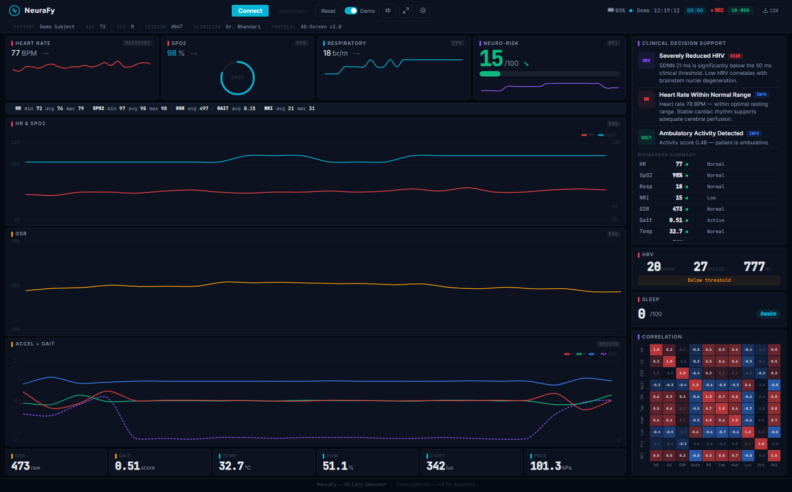
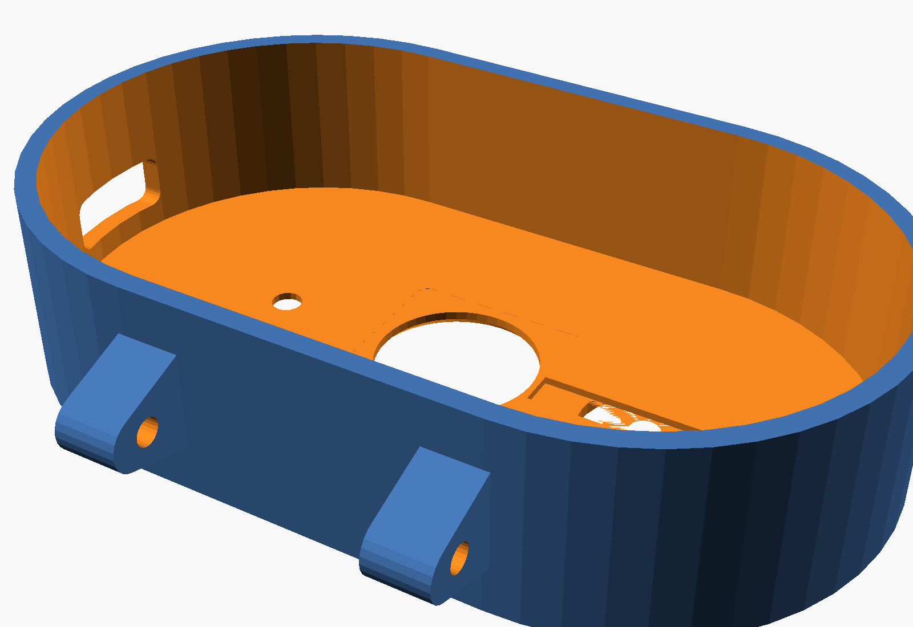

<div align="center">

<h1>NeuraBand</h1>

<p><b>A wearable biomarker monitor for the early detection of Alzheimer's disease</b></p>

<p>
NeuraBand is a pill-sized wearable that continuously and passively tracks <b>ten</b> neurologically
relevant biomarkers, then streams them live over Bluetooth Low Energy to a clinical-grade
dashboard and a patient-facing mobile app. It is designed as the wearable, hardware
counterpart to an MRI/PET-based model for predicting Alzheimer's disease progression.
</p>

<p>


</p>



</div>

---

<p align="center">
<a href="#why-it-matters">Why It Matters</a> &nbsp;·&nbsp;
<a href="#how-it-works">How It Works</a> &nbsp;·&nbsp;
<a href="#the-ten-modalities">Modalities</a> &nbsp;·&nbsp;
<a href="#the-device">The Device</a> &nbsp;·&nbsp;
<a href="#whats-in-this-repo">Components</a> &nbsp;·&nbsp;
<a href="#quick-start">Quick Start</a> &nbsp;·&nbsp;
<a href="#bill-of-materials">BOM</a> &nbsp;·&nbsp;
<a href="#ble-protocol">BLE Protocol</a> &nbsp;·&nbsp;
<a href="#scientific-basis">Science</a>
</p>

---

## Why It Matters

Alzheimer's disease begins damaging the brain **years before memory symptoms appear** — and
some of the earliest regions affected are those that govern *autonomic* functions: heart-rhythm
regulation, skin conductance, and motor coordination. Today those changes are usually caught
only at an annual clinic visit, if at all.

NeuraBand takes the opposite approach: **continuous, passive monitoring**. By wearing one
unobtrusive band, a subject contributes a 24/7 stream of prodromal biomarkers — the kind of
longitudinal signal that periodic assessments simply cannot capture.

Four of the ten tracked modalities are *primary* AD biomarkers, each chosen for a documented
link to neurodegeneration:

| Biomarker | Sensor | Why it is relevant to Alzheimer's |
|-----------|--------|-----------------------------------|
| **Heart-rate variability** | MAX30102 PPG | Low HRV reflects autonomic dysfunction; the lowest-HRV / highest blood-pressure-variability quartile carries a **2.34× ADRD risk** *(Rouch et al., 2024)*. |
| **Blood oxygen (SpO₂)** | MAX30102 pulse oximetry | Reduced peripheral SpO₂ is associated with cognitive impairment and sleep-disordered breathing. |
| **Electrodermal activity** | Grove GSR + built-in electrodes | EDA is governed by the ventromedial frontal cortex and anterior cingulate — regions hit early in AD pathology. |
| **Gait variability** | BMI270 IMU | The **strongest evidence base**: wearable-IMU gait analysis differentiates dementia subtypes, and ML on gait data reaches **85.5% accuracy** detecting mild cognitive impairment. |

> No single biomarker is diagnostic. NeuraBand's value is in **fusing many weak signals** into one
> longitudinal picture — see the [Scientific Basis](#scientific-basis) section for 13
> peer-reviewed studies behind these choices.

---

## How It Works

Six sensors feed an Arduino Nano 33 BLE Sense Rev2. On-device firmware fuses them into ten
modality streams plus a composite **Neuro-Risk Index**, packages everything as a compact JSON
frame once per second, and notifies any connected Bluetooth client.

```
   SENSORS                         DEVICE                              CLIENTS

 MAX30102  --+                                                  +-->  Web Dashboard
 Grove GSR --+                                                  |     Web Bluetooth / Chrome
 BMI270    --+--> Arduino Nano 33 BLE Sense Rev2  --BLE 5.0 -----+
 HS3003    --+      nRF52840 SoC                                 |
 APDS9960  --+      10-modality fusion + Neuro-Risk Index        +-->  Mobile App
 LPS22HB   --+      JSON telemetry @ 1 Hz                              React Native / Expo
```

The device exposes one custom 128-bit GATT service over Bluetooth Low Energy. Any Web Bluetooth
browser or the React Native app can connect to it directly — no pairing dance, no cloud account,
no companion dongle.

---

## The Ten Modalities

The Nano 33 BLE Sense carries an IMU and environmental sensors on-board, so a single external
PPG breakout and a GSR module are enough to surface **ten** continuous streams:

| # | Modality | Sensor | What it captures |
|:-:|----------|--------|------------------|
| 1 | Heart-rate variability | MAX30102 PPG | SDNN / RMSSD / IBI — autonomic regulation |
| 2 | Blood oxygen (SpO₂) | MAX30102 | Peripheral oxygenation |
| 3 | Electrodermal activity | Grove GSR + SS electrodes | Sympathetic / stress response |
| 4 | Gait variability | BMI270 IMU | Activity level and motor patterns |
| 5 | Respiratory rate | MAX30102 (PPG envelope) | Breathing extracted from sinus arrhythmia |
| 6 | Skin temperature | HS3003 | Circadian-rhythm tracking |
| 7 | Sleep quality | BMI270 actigraphy | Cole–Kripke sleep/wake estimation |
| 8 | Skin humidity | HS3003 | Sweat / sympathetic response |
| 9 | Ambient light | APDS9960 | Circadian light exposure |
| 10 | Barometric pressure | LPS22HB | Altitude / floor-change detection |
| ★ | **Neuro-Risk Index** | *computed* | Weighted fusion of every stream into a 0–100 score |

---

## The Device

A 70 × 42 × 21 mm pill-shaped enclosure, 3D-printed in PLA, that mounts to any standard 24 mm
quick-release watch band. The skin-facing surface integrates the optical PPG window and two
stainless-steel GSR electrodes; the side carries a USB-C charging port and a power switch.



<table>
<tr>
<td width="50%"></td>
<td width="50%"></td>
</tr>
<tr>
<td align="center"><sub>500 mAh LiPo seated above the Arduino</sub></td>
<td align="center"><sub>Skin side — optical PPG window flanked by GSR electrodes</sub></td>
</tr>
<tr>
<td width="50%"></td>
<td width="50%"></td>
</tr>
<tr>
<td align="center"><sub>USB-C charge port and power switch</sub></td>
<td align="center"><sub>Embossed shell — print-finished detail</sub></td>
</tr>
</table>

---

## What's in This Repo

NeuraBand is a full hardware-plus-software build. Every layer lives here:

### Firmware &nbsp;·&nbsp; `firmware/`

An 884-line Arduino sketch (`neuraband_firmware.ino`) that runs the whole device:

- **10-modality sensor fusion** with non-blocking `millis()` scheduling — MAX30102 at 50 Hz,
  GSR and IMU at 10 Hz, environmental sensors at 0.1 Hz, BLE transmit at 1 Hz.
- **On-device HRV** — SDNN computed from a rolling 60-sample inter-beat-interval buffer.
- **SpO₂** via a ratio-of-ratios method with an empirical MAX30102 calibration curve.
- **Respiratory rate** extracted from the PPG amplitude envelope (respiratory sinus arrhythmia).
- **Sleep actigraphy** — a simplified Cole–Kripke classifier over a 5-minute motion window.
- **Composite Neuro-Risk Index** — weighted multimodal fusion into a single 0–100 score.
- **Resilience built in** — software watchdog (resets on a >5 s loop stall), I²C bus
  auto-recovery, a BLE software-reset characteristic, and tri-color LED status indicators.

### Clinical Dashboard &nbsp;·&nbsp; `dashboard/`

A zero-install web app that connects straight to the device through the **Web Bluetooth API**.



- Real-time Chart.js plots (HR & SpO₂, GSR, accelerometer + gait) on a 60-second rolling window.
- A **Clinical Decision Support** panel that turns evidence-based thresholds into plain-language
  insights, alongside a 10-modality biomarker summary table.
- Dedicated HRV (SDNN / RMSSD / IBI), SpO₂ ring, sleep, and cross-modality correlation panels.
- Dark / light themes, a session timer, CSV export for ML pipelines, auto-reconnect, and a
  **demo mode** that streams synthetic physiology so the dashboard works with no hardware.
- Ships as `index.html` + `app.js` + `style.css`, plus a single-file `neurafy_standalone.html`.

### Mobile App &nbsp;·&nbsp; `mobile/`

A patient-facing React Native companion (Expo SDK 54, React Native 0.81) — the friendly
counterpart to the clinician dashboard.

- Five tabs — **Vitals**, **Trends**, **Tips**, **Ask**, and **More** — behind a guided
  onboarding flow.
- Connects to the band over BLE with `react-native-ble-plx`; clinical terms are softened into
  everyday language (*Brain Health*, *Heart Calmness*, *Movement*).
- A daily wellness score, a wear-streak tracker, and a conversational **health assistant** that
  answers plain-language questions about the latest readings.
- System-driven dark / light theming, haptics, on-device persistence, and the same synthetic
  **demo mode** — the app is fully explorable without a physical device.

### Enclosure &nbsp;·&nbsp; `enclosure/`

- A fully **parametric OpenSCAD** model (`neuraband_case.scad`) — every component pocket,
  the optical window, electrode bores, lug tabs, and screw bosses are driven by named variables.
- Ready-to-print STL shells (`bottom_shell.stl`, `top_shell.stl`, `test_fit.stl`) plus a `stl/`
  library of component models for fit visualization.
- High-resolution product renders (`renders/`) generated by the included Blender script
  `render_neurafy.py`.

### Docs &nbsp;·&nbsp; `docs/`

The full [bill of materials](docs/bom.md), a [wiring diagram](docs/wiring_diagram.txt) with the
complete pin map and I²C address table, [13 scientific references](docs/scientific_references.md),
and a printable parts-list PDF.

---

## Quick Start

Every part of NeuraBand can be explored on its own — and the dashboard and app both have a demo
mode, so **you do not need to build the hardware to try the software**.

### 1 · Print the enclosure

Open the print-ready wrappers in OpenSCAD, or drop the STL files straight into your slicer.

| Setting | Value |
|---------|-------|
| Layer height | 0.15 mm |
| Walls | 4 perimeters |
| Infill | 40% gyroid |
| Material | PLA (210 °C / 60 °C) |
| Supports | Tree — lug tabs only |
| Brim | 5 mm |



### 2 · Flash the firmware

```bash
# Arduino IDE 2.x — install these from the Library Manager:
#   ArduinoBLE · Arduino_BMI270_BMM150 · Arduino_HS300x
#   Arduino_APDS9960 · Arduino_LPS22HB · SparkFun MAX3010x Sensor Library

# Board:  Arduino Nano 33 BLE
# Sketch: firmware/neuraband_firmware/neuraband_firmware.ino
# Connect the board over USB and upload (Ctrl/Cmd + U)
```

### 3 · Launch the dashboard

```bash
cd dashboard
python -m http.server 8000
# Open Chrome at http://localhost:8000
# Click "Connect" and pick "NeuraFy" (the device's Bluetooth name) — or flip "Demo" for no hardware.
```

> Web Bluetooth requires Chrome, Edge, or another Chromium browser over `http://localhost` or HTTPS.

### 4 · Run the mobile app

```bash
cd mobile
npm install
npx expo start
# Scan the QR code with Expo Go, or press  i / a  for an iOS / Android simulator.
```

The app opens in demo mode out of the box — no device or pairing required.

---

## Bill of Materials

The core electronics come in around **$55–65**; a complete build with band, fasteners, and
filament lands near **$75–85**.

| Component | Qty | Approx. cost | Notes |
|-----------|:---:|:------------:|-------|
| Arduino Nano 33 BLE Sense Rev2 | 1 | $35 | nRF52840, BMI270 IMU, BLE 5.0 |
| MAX30102 breakout (RCWL-0531) | 1 | $3–5 | Must be the 3.3 V I²C variant |
| Grove GSR sensor | 1 | $8–10 | Includes electrodes and cable |
| 500 mAh LiPo battery | 1 | $5–8 | Flat pouch with JST connector |
| TP4056 USB-C charging module | 1 | $2–3 | DW01A-protected (6-pin) version |
| MT3608 boost converter | 1 | $1–2 | Adjusted to 5.0 V output |
| Quick-release watch band (24 mm) | 1 | ~$5 | Standard spring-bar band |
| 3D-print filament, M2 screws, wiring, VHB tape | — | ~$10 | See full list |

> The complete, itemized list — including optional finishing supplies and required tools —
> is in [`docs/bom.md`](docs/bom.md).

---

## BLE Protocol

The device exposes one custom 128-bit GATT service. Sensor frames are pushed via notifications
once per second.

| Characteristic | UUID | Access | Purpose |
|----------------|------|--------|---------|
| Service | `19B10000-E8F2-537E-4F6C-D104768A1214` | — | GATT service container |
| Sensor Data | `19B10001-…` | Notify (1 Hz) | JSON sensor frame |
| Device Status | `19B10002-…` | Read | Firmware version + per-sensor health |
| Reset Command | `19B10003-…` | Write | Write `0x01` to reboot the device |

Each `Sensor Data` notification is a compact JSON object:

```json
{"hr":74,"sp":98,"gsr":487,"gait":0.42,"ibi":810,"ax":0.01,"ay":-0.99,"az":0.12,
 "rr":16,"tmp":32.4,"hum":48.0,"lux":220,"prs":101.3,"slp":82,"slps":0,"nri":21,
 "bt":85,"ts":42000}
```

| Key | Field | Key | Field |
|-----|-------|-----|-------|
| `hr` | Heart rate (BPM) | `tmp` | Skin temperature (°C) |
| `sp` | SpO₂ (%) | `hum` | Skin humidity (%) |
| `gsr` | Electrodermal activity (raw ADC) | `lux` | Ambient light (clear channel) |
| `gait` | Gait activity score | `prs` | Barometric pressure (kPa) |
| `ibi` | Inter-beat interval (ms) | `slp` | Sleep quality score (0–100) |
| `ax` `ay` `az` | Accelerometer (g) | `slps` | Sleeping flag (0 / 1) |
| `rr` | Respiratory rate (breaths/min) | `nri` | Neuro-Risk Index (0–100) |
| `bt` | Battery (%, −1 if unmonitored) | `ts` | Uptime (ms since boot) |

---

## Repository Layout

```
NeuraBand/
├── firmware/
│   └── neuraband_firmware/
│       └── neuraband_firmware.ino     Arduino firmware (884 lines)
├── dashboard/
│   ├── index.html · app.js · style.css   Web Bluetooth clinical dashboard
│   └── neurafy_standalone.html         Single-file build (no server needed)
├── mobile/
│   ├── App.js                          Entry point + tab navigation
│   └── src/
│       ├── screens/                    Vitals · Trends · Tips · Ask · Settings · Onboarding
│       ├── components/                 Reusable UI building blocks
│       ├── context/ · services/        BLE + synthetic-demo data providers
│       └── utils/                      HRV, threshold, and trend helpers
├── enclosure/
│   ├── neuraband_case.scad             Parametric OpenSCAD source
│   ├── print_*.scad · *.stl            Print-ready parts
│   ├── stl/ · renders/                 Component models + product renders
│   └── render_neurafy.py               Blender render script
├── docs/
│   ├── bom.md · wiring_diagram.txt     Build references
│   ├── scientific_references.md        13 peer-reviewed citations
│   └── images/                         README assets
└── README.md
```

---

## Scientific Basis

Each primary biomarker was selected from the peer-reviewed literature. Gait carries the
strongest evidence; HRV, SpO₂, and EDA are supporting signals whose power comes from being
combined rather than read in isolation.

<details>
<summary><b>13 peer-reviewed studies — click to expand</b></summary>

<br>

**Heart-rate variability**
1. da Silva VP et al. *Heart Rate Variability Indexes in Dementia: A Systematic Review.* Curr Alzheimer Res. 2018.
2. Choe YM et al. *HRV response to physical challenge predicts cognitive decline in MCI.* Front Aging Neurosci. 2022.
3. Rouch L et al. *Combined blood-pressure variability and HRV predict ADRD risk (HR 2.34).* Sci Rep. 2024.
4. Eyre B et al. *A critical perspective on HRV as an AD biomarker.* J Alzheimers Dis. 2026.

**Blood oxygen (SpO₂)**
5. *Peripheral oxygen saturation and cognitive impairment.* Sci Rep. 2025.
6. Bhatt S et al. *Sleep-disordered breathing, oxygenation coupling, and cognitive decline.* Sci Rep. 2024.

**Electrodermal activity**
7. Tranel D, Damasio H. *Neuroanatomical correlates of electrodermal responses.* Psychophysiology. 1994.
8. Tranel D. *Electrodermal activity in cognitive neuroscience.* Oxford Handbook of ERP Components. 2011.
9. van den Berg ME et al. *Electrodermal activity in dementia assessment.* Dement Geriatr Cogn Disord Extra. 2018.

**Gait analysis** *(strongest evidence)*
10. Mc Ardle R et al. *Wearable accelerometers differentiate dementia subtypes.* Gait Posture. 2020.
11. Soltani A et al. *ML ensemble achieves 85.5% MCI detection from IMU gait data.* Front Neurol. 2024.
12. Mc Ardle R et al. *Multi-centre study of gait changes in mild AD.* Alzheimers Res Ther. 2020.
13. *Wearable sensor system for early AD detection via multilevel gait assessment.* IEEE Access. 2023.

</details>

Full citations with DOIs and PMIDs are in [`docs/scientific_references.md`](docs/scientific_references.md).

---

## Limitations & Disclaimer

> [!IMPORTANT]
> **NeuraBand is a research prototype and a science-fair proof of concept — not a medical
> device.** It is not FDA-cleared, not clinically validated, and must not be used to diagnose,
> treat, or make decisions about any health condition.

- Consumer-grade sensors are far less accurate than clinical instruments; wrist PPG in
  particular is a weaker source for HRV than clinical ECG.
- The SpO₂ calibration curve is empirical and needs per-device tuning.
- GSR as a *preclinical* AD biomarker remains exploratory.
- Meaningful conclusions require longitudinal baselines — months or years of per-subject data.
- The Neuro-Risk Index is a demonstration of multimodal sensor fusion, **not** a diagnostic score.

---

## Credits

Built by **Soumil Bhandari** as a regional science-fair project — a wearable approach to
detecting Alzheimer's disease progression through continuous, passive biomarker monitoring.

Released under the [MIT License](LICENSE).
